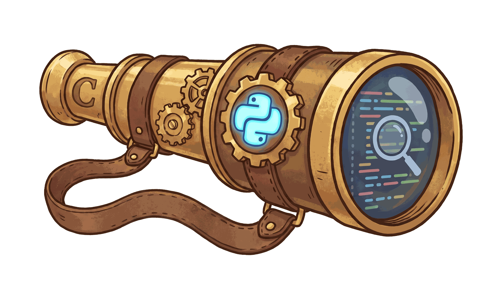

# Spyglass

Design-first Python development for Claude Code.

> Named for the instrument you raise before you cross unfamiliar ground. It doesn't move you an inch — it just means you know what's out there before you commit.

## What it does

Spyglass runs structured design analysis before you write a line of Python, so the common failure modes never make it into the code:

| Failure mode | How Spyglass addresses it |
|---|---|
| Reimplementing existing functionality | Four parallel library-investigation agents (codebase, stdlib, dependencies, PyPI) plus a synthesiser |
| Ignoring codebase conventions | A pattern-analysis pass runs before contract design and constrains it |
| Oversized functions / classes | Style checking enforces Google style guide rules on the plan, not just the code |
| Refactoring never considered | Four detection signals auto-trigger a refactor assessment; adopted refactors get written into the plan |
| Tasks too large for one session | A two-phase scope assessment plus persistent, resumable artefacts |
| No cross-session continuity | The artefact folder is read at the start of every run and updated at the end |
| Too many assumptions, too little input | A human-in-the-loop checkpoint at every major decision point |

Spyglass produces a design and stops. It never implements on your behalf — implementation is always a separate, explicitly-chosen step at the end of the run.

If your request is open to more than one reading in a way that would change the design, Spyglass asks — once, with concrete options drawn from what it found in your codebase. Where existing code plausibly already does the job, that is one of the options, because the most useful answer a design pass can give you is sometimes "you don't need to write this".

## Installation

```
/plugin marketplace add 8ballbb/spyglass
/plugin install spyglass@spyglass
```

## Usage

```
/spyglass:spyglass <task description>              standard run
/spyglass:spyglass --tests <task description>       force test planning
/spyglass:spyglass --refactor <task description>    force refactor assessment even when no signal fires
/spyglass:spyglass --no-refactor <task description> suppress refactor assessment even when signals fire
/spyglass:spyglass --complete <feature-slug>        mark a feature complete and write its summary
/spyglass:spyglass --verify <feature-slug>          check the built code against the plan it came from
/spyglass:spyglass --audit <path>                   assess existing code, no task needed
/spyglass:spyglass --auto <task description>        run to completion, taking sensible defaults
```

**`--audit` is the one to try first.** Everything else needs a task before it is any use; `--audit src/` points the assessment agents at code you already have and returns a prioritised backlog — complexity in code that changes often, conventions that genuinely conflict, classes past their size limit. Capped at fifteen findings, because a backlog nobody can finish is a backlog nobody starts.

**`--verify` is what makes design-first checkable.** After you have implemented a plan, it compares what was built against what was designed — missing symbols, signature drift, functions over their complexity budget — and asks which side to correct. Drift is often the plan's fault, and updating the plan is a valid answer.

**`--auto` runs unattended** and takes the default at every checkpoint except two: when your request is genuinely ambiguous, and when the plan breaks a rule your standards say must not ship. It reports every decision it made at the end.

The `plugin:skill` form is how Claude Code addresses a plugin's skills — the same shape as `/superpowers:brainstorming`. A bare `/spyglass` will not resolve.

You will rarely need to type it. Spyglass engages on its own when you start Python implementation work — that is what it is for, and it is the point at which a design pass is worth anything. If you would rather it stayed out of the way for a particular task, just say so ("skip spyglass", "no design pass, just write it") and it will.

Refactor assessment is **signal-driven by default** — Spyglass watches for four warning signs (complexity, near-duplicate code, plans that push existing files over a size limit, inconsistent conventions) and runs the assessment on its own when one fires. Neither `--refactor` nor `--no-refactor` is needed for normal use; they only override that judgment in either direction.

## What a run looks like

**It is interactive.** A full run has twelve phases and ten checkpoints where Spyglass stops and waits for your input — it does not run to completion unattended. Two fast paths skip most of this for small changes.

```
Phase 1  — Context check                          Locate artefacts, detect orphaned state, generate slug
Phase 2a — Lightweight scope check                 └─ HIL-1: name + prior work + size
                                                    └─ HIL-1b (conditional): clarify an ambiguous request
Phase 4a — Module design
Phase 3  — Pattern analysis (conditional)          └─ HIL-2: module structure + conventions found
Phase 4b — Contract + signature design              └─ HIL-3: approve the full plan
Phase 2b — Scope re-check                           └─ HIL-4: confirm scope + sub-task breakdown
Phase 5  — Library investigation (4 agents, parallel)
Phase 6  — Investigation synthesis                  └─ HIL-5: approve reuse recommendation
                                                     └─ HIL-5b (conditional): approve revised plan
Phase 7  — Style & principles review                └─ HIL-6: fix hard violations, pick design ones
Phase 8  — Complexity assessment (conditional)
Phase 9  — Refactor assessment (conditional)        └─ HIL-7: complexity + refactor recommendations
Phase 10 — Test planning (conditional)               └─ HIL-8: confirm test cases
Phase 11 — Artefact update                          └─ HIL-9: confirm content before it's written
Phase 12 — Handoff                                  └─ HIL-10: implement now / hand off / stop here
```

Cost is proportional to how much of that flow actually runs — most runs use far fewer than eleven agents:

| Path | Agents spawned | Which |
|---|---|---|
| `fast-path-modify` (changing existing behaviour) | 2–3 | style-checker, complexity-assessor, + refactor-assessor if a signal fires |
| `fast-path-add` (one small new function or class) | 5–6 | codebase-searcher, stdlib-searcher, deps-searcher, synthesiser, style-checker, + refactor-assessor if a signal fires |
| Standard, no conditionals, no signals | 7 | scope-assessor, all 4 library-investigation searchers, synthesiser, style-checker |
| Standard + pattern analysis + complexity | 9 | the above + pattern-analyzer, complexity-assessor |
| Everything, including refactor and test planning | 11 | every design agent |
| `--verify <slug>` (separate flow, no design) | 1 | conformance-checker |

The two fast paths are chosen automatically from the task description — a short description that clearly names an existing function to modify, or clearly describes one small new function. **Both drop to two checkpoints** rather than ten: one to confirm the name and size, one to approve the plan. Anything else runs the standard flow.

Even on the fast path, Spyglass still checks what your project already depends on. Those packages are already installed and already paid for — a project that depends on a mature date parser should never be handed a hand-rolled one because nobody looked. Only the search for *new* PyPI packages is skipped, since adding a dependency for one small function rarely makes sense.

## Configuration

Optional. Some answers do not change between features, and being asked each time turns a settled matter into an interruption.

```toml
[tool.spyglass]
docstring_style    = "google"   # settles the convention; stops it being asked about
complexity_budget  = 15         # target for new functions, and the measuring threshold
max_function_lines = 40
max_class_lines    = 200
auto               = false      # run unattended by default
exclude            = ["migrations/**", "vendor/**"]
```

Put it in your `pyproject.toml`, or in a `.spyglass.toml` beside it. Every key is optional, unknown keys are ignored, and **Spyglass never writes this file** — what you say in a session always wins over it anyway.

## Where artefacts go

Every design artefact — pseudo-code plans, session context, test plans, index files — is written to `.claude/spyglass/` inside your project. On first run, Spyglass writes `.claude/spyglass/.gitignore` containing a single line, `*`, which makes that entire directory invisible to git.

If you run Spyglass somewhere with no Python project above it — no `pyproject.toml`, `setup.py`, `setup.cfg` or `requirements.txt` — the artefacts go to `~/.claude/spyglass/` instead, and it says so at the first checkpoint. Inside a project, the *nearest* marker wins: a package nested in a monorepo gets its own artefact folder rather than the repository root's.

**Your project's root `.gitignore` is never read, created, or modified.** This is deliberate: that file is tracked, shared, and often governed by team policy, and a plugin that silently edits it produces an unexpected diff in your next commit. Spyglass leaves it alone, always. If you'd rather have the artefacts tracked, delete `.claude/spyglass/.gitignore` — Spyglass will not recreate it.

## Known issues

Spyglass sometimes reports an internal identifier — a message beginning `S1
fired` rather than describing what it found. Cosmetic, and being fixed; see
[`docs/verification-backlog.md`](docs/verification-backlog.md) for that and
everything else known-but-unverified.

## Requirements

- A Python project. (It runs outside one too — artefacts fall back to `~/.claude/spyglass/` — but the reuse investigation has much less to work with.)
- [`complexipy`](https://pypi.org/project/complexipy/) and [`radon`](https://pypi.org/project/radon/) are both optional. Either improves the accuracy of complexity assessment — complexipy is preferred, because cognitive complexity charges for nesting and cyclomatic complexity does not. If neither is installed, Spyglass proceeds without them and never prompts you to install anything; your environment is not this plugin's business.
- No dependency on any other plugin. Every phase runs standalone; if `superpowers` happens to be installed, Spyglass offers an additional handoff option at the end, but nothing about the design flow requires it.

## Changelog

See [CHANGELOG.md](CHANGELOG.md).

## Licence

MIT — see [LICENSE](LICENSE).
